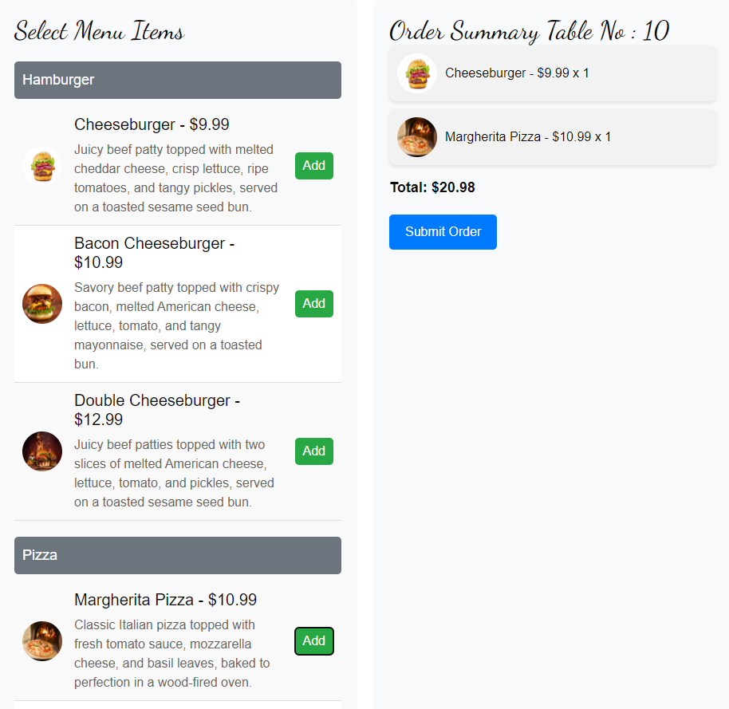

# LibertyLux

LibertyLux is a comprehensive restaurant Point of Sale (POS) system designed to streamline the process of taking orders, managing kitchen workflows, and facilitating payments. This system enables servers to take customer orders and instantly relay them to the kitchen, where cooks can monitor, prepare, and notify when the orders are ready. Additionally, cashiers can view the total orders for each table, enabling an efficient checkout experience.

## Tech Stack

LibertyLux utilizes an N-Tier architecture and repository pattern, structured as follows:

### Frontend:

- **HTML, CSS, and JavaScript**: Used for constructing and styling the web interface.
- **ASP.NET MVC**: Facilitates dynamic page rendering as the client-side framework.
- **SignalR Client Library**: Provides real-time web functionality.

### Backend:

- **.NET 8**
- **ASP.NET Web API**
- **C#**
- **Entity Framework Core (Code First)**
- **SQL Server**

### Real-time Communication:

- **SignalR**: Enables real-time web functionality, such as live order updates.

## Architecture and Design Patterns

LibertyLux is built using an N-Tier architecture to ensure a clear separation of concerns, promoting maintainability and scalability. This section outlines the architecture layers and key design patterns:

### N-Tier Architecture:

- **Presentation Layer**: The user interface, created with ASP.NET MVC, designed to be dynamic and user-friendly for servers, cooks, and cashiers.
- **Business Logic Layer (BLL)**: Contains the core business logic and functionalities. It houses services that implement specific business rules and workflows.
- **Entity Layer**: Defines the domain entities or models that represent the business data and rules.
- **Data Access Layer (DAL)**: Implements the Repository Pattern to abstract interaction with the data source, managing data persistence and retrieval operations.

### Repository Pattern:

- The DAL employs the Repository Pattern to provide a simplified interface for data access operations.

### Incorporating Services:

- Services within the BLL execute business logic, abstract complex operations, and interact with the DAL. This ensures the Presentation Layer remains decoupled from direct data manipulation.

## Features

### Customer Features:

- **View Menu and Filter by Category**: Customers can browse the menu and filter by category.

### Server Features:

- **Table Management**: Servers can view the current status of all tables within the restaurant in real-time, including occupancy and order status.
- **Order Taking**: Simplifies the process by allowing servers to input orders directly into the POS system. Orders are immediately relayed to the kitchen for preparation.
- **Real-Time Order Status Updates**: Servers receive updates from the kitchen regarding order status, ensuring timely delivery of food to customers.

### Cook Features:

- **Live Order Queue**: Cooks view a real-time list of incoming orders.
- **Order Status Management**: Cooks update the status of each order, with updates instantly relayed to servers and front-of-house staff.

### Cashier Features:

- **Order and Bill Review**: Cashiers access detailed views of table orders and corresponding bills, including itemized selections and total amounts due.

# LibertyLux Media Showcase

Explore the LibertyLux project through this media showcase, featuring screenshots and video demonstrations of key functionalities across the platform.

## Screenshots

### Cashier Interface

### Cook Interface

### Creating a New Order

### Customer Menu

### Server Interface

## Video Demonstrations

For a more dynamic look at LibertyLux, check out these video demonstrations:

### Video Overview 1

### Video Overview 2

### Video Overview 3

### Video Overview 4

### Video Overview 5

